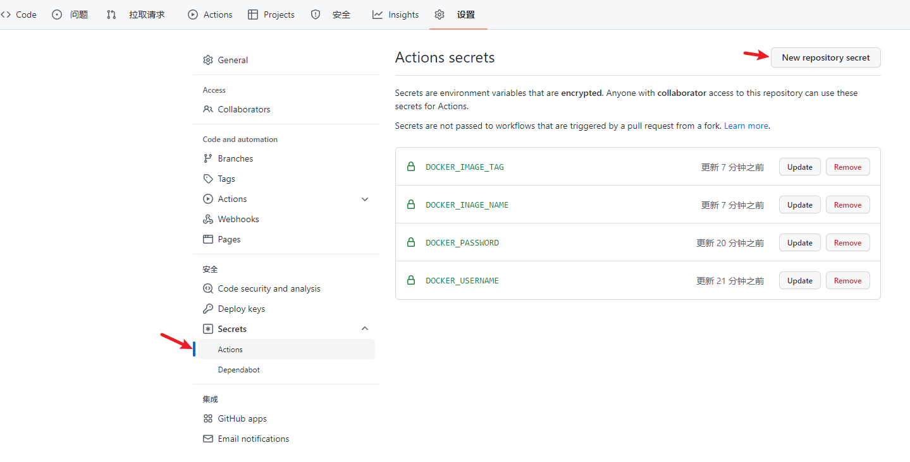
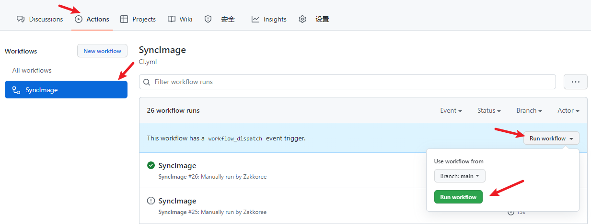
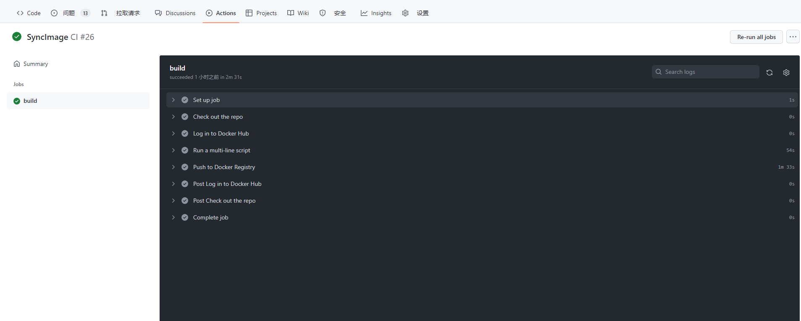
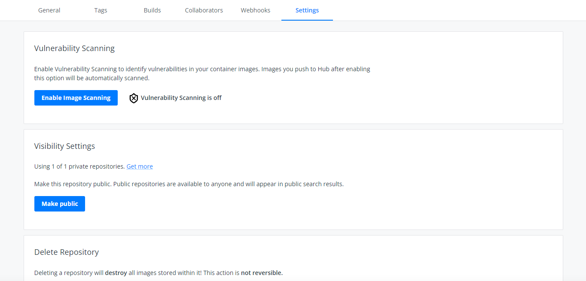

# SyncImages
经常k8s.gcr.io ,quay.io之类的国外镜像拉取不过来，那怎么办呢？  
使用github action拉取镜像推送到Dockerhub的方法。推送好了之后，自己拉取镜像retag一下就能用了

## 1. 创建一个Github仓库
## 2. 初始化Action
* 如果 .github/workflows 目录不存在，请在 GitHub 的仓库中创建此目录。
* 在 .github/workflow 目录中，创建一个名为 github-actions-sync-image.yml 的文件。
* 将以下 YAML 内容复制到 github-actions-sync-image.yml 文件中：

```yaml
# This is a basic workflow to help you get started with Actions

name: SyncImage

# Controls when the workflow will run
on:
  # Triggers the workflow on push or pull request events but only for the "main" branch
  issues:
    types:
      - opened

  # Allows you to run this workflow manually from the Actions tab
  workflow_dispatch:

# A workflow run is made up of one or more jobs that can run sequentially or in parallel
jobs:
  # This workflow contains a single job called "build"
  build:
    # The type of runner that the job will run on
    runs-on: ubuntu-latest
    environment: IMAGES
    # Steps represent a sequence of tasks that will be executed as part of the job
    steps:
      # Checks-out your repository under $GITHUB_WORKSPACE, so your job can access it
      - name: Check out the repo
        uses: actions/checkout@v2

      - name: Log in to Docker Hub
        uses: docker/login-action@v1
        with:
          username: ${{secrets.DOCKER_USERNAME}}
          password: ${{secrets.DOCKER_PASSWORD}}

      # Runs a set of commands using the runners shell
      - name: Run a multi-line script
        run: |
          docker pull ${{secrets.IMAGE_NAME}}
          docker tag ${{secrets.IMAGE_NAME}} ${{secrets.DOCKER_USERNAME}}/${{secrets.IMAGE_TAG}}
          
      # Runs a set of commands using the runners shell
      - name: Push to Docker Registry
        run: |
          docker push ${{secrets.DOCKER_USERNAME}}/${{secrets.IMAGE_TAG}}
```

## 3. 创建DockerHub Secret  

### 参数说明  
* DOCKER_USERNAME: docker用户ID  <font color="red">注意不是邮箱</font>
* DOCKER_PASSWORD: docker用户密码
* DOCKER_IMAGE_NAME: 要下载镜像  
* DOCKER_IMAGE_TAG: 给镜像重新打上tag <font color="red">注意不要有 /</font>

## 4. 执行构建  
上面配置的触发方式为issuer和manually
docker配置完成提交issuer执行或者手动执行


也可设置push代码执行
```yaml
on:
  # Triggers the workflow on push or pull request events but only for the "main" branch
  push:
    branches: [ "main" ]
  pull_request:
    branches: [ "main" ]
```
## 5. 观察gitlab CI输出

## 6. 拉取镜像
登陆docker或者设置公共镜像仓库

registry: docker.io  
docker pull dockerId/imagesName:imagesTag

好了，开始愉快的使用吧。
